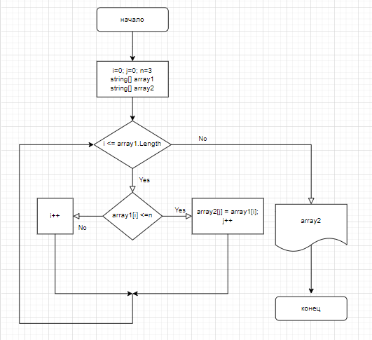

# Итоговая работа

## Задача

Написать программу, которая из имеющегося массива строк формирует новый массив из строк, длина которых меньше, либо равна 3 символам. Первоначальный массив можно ввести с клавиатуры, либо задать на старте выполнения алгоритма. При решении не рекомендуется пользоваться коллекциями, лучше обойтись исключительно массивами.

Примеры:
[“Hello”, “2”, “world”, “:-)”] → [“2”, “:-)”]
[“1234”, “1567”, “-2”, “computer science”] → [“-2”]
[“Russia”, “Denmark”, “Kazan”] → []

## Решение

1. Создали блок-схему алгоритма решения задачи.
2. В коде программы задали строковый массив *array*.
3. Создали метод (*FillArray*) для заполнения строкового массива пользователем.
4. Создали метод (*PrintArray*) для вывода сформированного строкового массива.
5. Создали метод (*GetSizeArray*) для определения размера нового строкового массива *array2*, длина элементов которого меньше, либо равна 3 символам начального массива *array*.
5. Создали метод (*GetSizeArray*) для определения размера нового строкового массива *array2*, длина элементов которого меньше, либо равна 3 символам начального массива *array*.
6. Метод (*MakeNewArray*) записывает элементы массива *array* в новый массив *array2* только те элементы, длина элементов которого меньше, либо равна 3 символам.
7. Вывод элементов нового созданного массива *array2* выводяться на экран методом (*PrintArray*).

## Блок-схема алгоритма задачи

Блок-схема решения задачи
